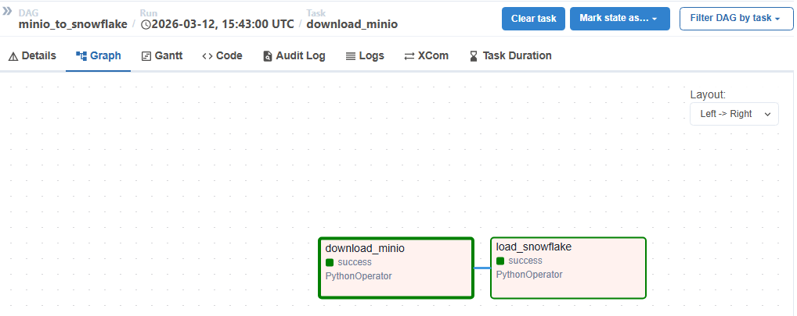
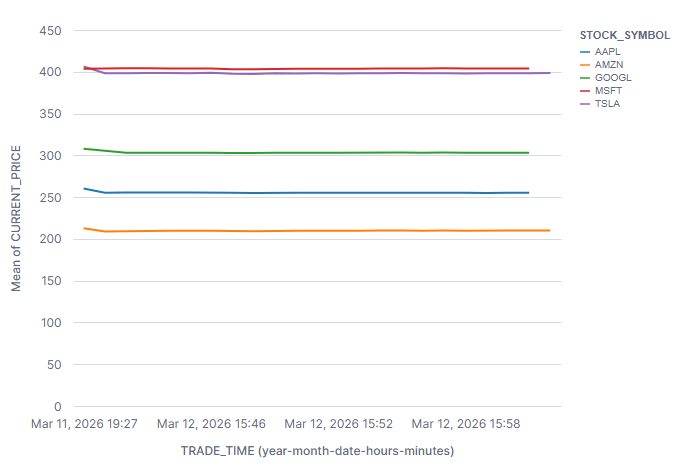
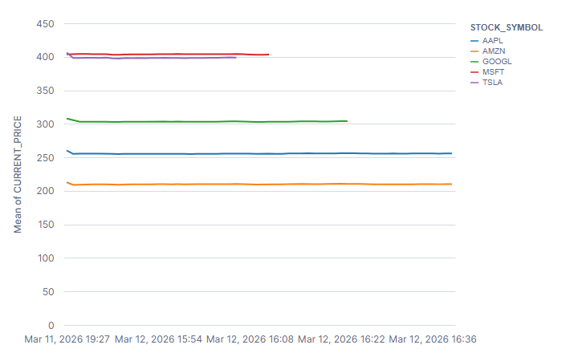

# Real-Time Stock Market Data Pipeline

## Project Overview
Using a modern data stack, this project shows a real-time data pipeline of the stock market.

Fetched live stock prices from an external API, streamed in real-time using Kafka, orchestrated through Airflow, transformed with dbt inside Snowflake, and finally visualized trends and KPIs using Power BI dashboards.

## Tech Stack
* **Python:** Used to write the scripts that fetch the live data from the external internet API.
* **Docker:** Packages all the different software tools into isolated containers so they can run smoothly on any computer.
* **Apache Kafka:** Acts as the high-speed streaming engine that catches and moves the live stock data as soon as it arrives.
* **Apache Airflow:** Serves as the automated manager that schedules and triggers the different tasks in the pipeline.
* **Snowflake:** A cloud-based data warehouse used to safely store massive amounts of information.
* **dbt:** A transformation tool that cleans, organizes, and formats the raw data inside Snowflake so it is ready for analysis.
* **Power BI:** Connects to the finalized data to create visual charts, graphs, and business dashboards.

## Description
This project is a fully automated pipeline that continuously pulls live stock market prices from a real-world API and streams them instantly using Kafka. Once the data is captured, Airflow automatically coordinates its movement into a Snowflake cloud data warehouse, where dbt cleans and structures the raw information into neat, analytical tables. Finally, this organized data is connected to Power BI to generate interactive, real-time dashboards that display stock price movements, comparative trends, and key performance indicators (KPIs).

## What Really Happens?

### 1. The project uses Docker to quickly launch Kafka. A dedicated channel is created specifically to handle the rapid, continuous flow of incoming stock market events without losing any information.

### 2. A custom Python script acts as a data gatherer. It connects to an external financial API, retrieves the most up-to-date stock prices, and instantly sends this information into the Kafka streaming engine.

### 3. Another Python script continuously listens to the Kafka stream. As soon as new stock data flows in, this script catches it and saves it securely into a storage system so no historical data is lost.

### 4. Apache Airflow acts as the project's schedule manager. It automatically picks up the raw data from the storage system and loads it into the Snowflake data warehouse at regular intervals, ensuring the pipeline runs without human intervention.

### 5. Snowflake is configured to hold the data in different stages. It starts by storing the raw, messy data, then holds a cleaned-up version, and finally stores a highly organized version that is perfectly formatted for business reports.

### 6. The tool dbt (data build tool) is used to perform the actual cleaning inside Snowflake. It takes the messy raw data, filters out errors, and builds standard tables that make it easy to calculate trends and insights.

### 7. Power BI connects directly to the final, cleaned data in Snowflake. It translates the numbers into visual dashboards, showing real-time price changes, trading volumes, and performance metrics through interactive charts and graphs.

## Steps to Run
1. Clone the repository
2. Configure environment variables (API keys, Snowflake credentials)
3. Start services using Docker Compose
4. Run the Kafka producer to fetch live stock data
5. Airflow orchestrates ingestion into Snowflake
6. dbt applies transformations
7. Connect Power BI to Snowflake for visualization

## A First Quick Check: Verifying the Airflow Pipeline
To verify that the automated pipeline is successfully moving data, you can check the Apache Airflow dashboard. 
1. Navigate to your Airflow web interface.
2. Click on the `minio_to_snowflake` DAG.
3. Click on the **Graph** tab. 

Here, you can visually monitor the task execution. A dark green border around the boxes confirms that the Python tasks successfully executed, proving that data was downloaded from MinIO and successfully loaded into Snowflake.

## A Second Quick Check: Real-Time Data Visualization in Snowflake
While Power BI is the primary visualization tool for this project, you can quickly prove the real-time streaming capabilities directly inside Snowflake using its built-in charting feature.

1. Log into Snowflake and open a SQL Worksheet.
2. Run a query to extract and flatten the live JSON data from the `bronze_stocks_quotes_raw` table.
3. Click the **Chart** button above the results to generate a Line Chart (X-Axis: Time, Y-Axis: Price, Series: Symbol).

To prove the real-time nature of the pipeline:
1. Return to the Airflow dashboard and manually click the **Play** button -> **Trigger DAG** to fetch a new batch of live market prices.
2. Wait for the Airflow tasks to turn green.
3. Return to Snowflake and re-run the exact same SQL query.

**Interpretation:** By comparing the two charts, you can clearly see the lines extending further to the right in the second image. Each line represents a different stock ticker (AAPL, AMZN, GOOGL, MSFT, TSLA). The extension of these lines proves that the pipeline successfully captured new data points from the live API, streamed them through Kafka, orchestrated them via Airflow, and appended them to the Snowflake warehouse in real-time.